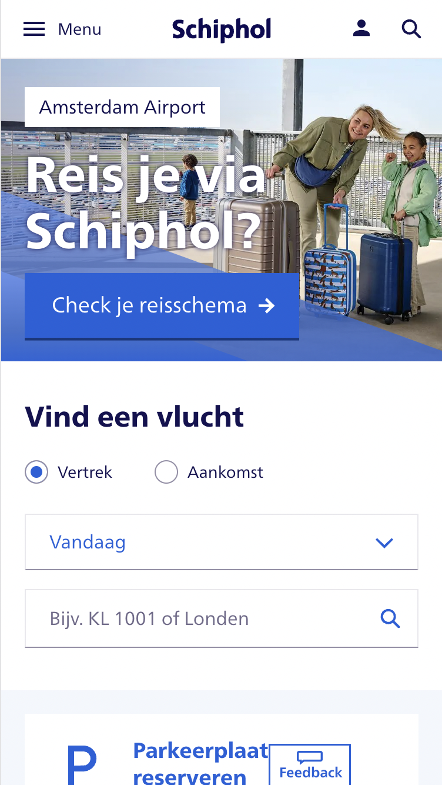
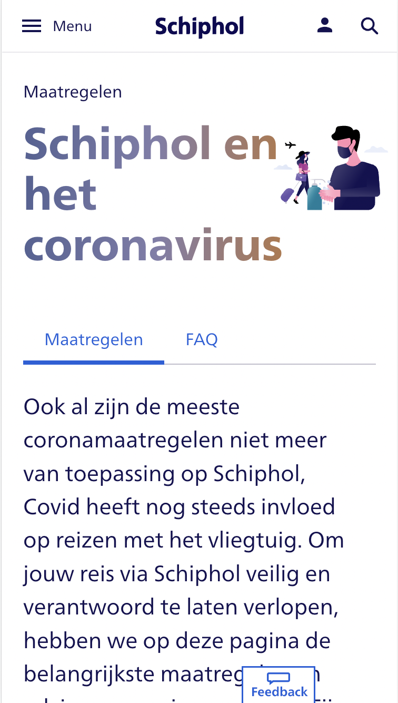
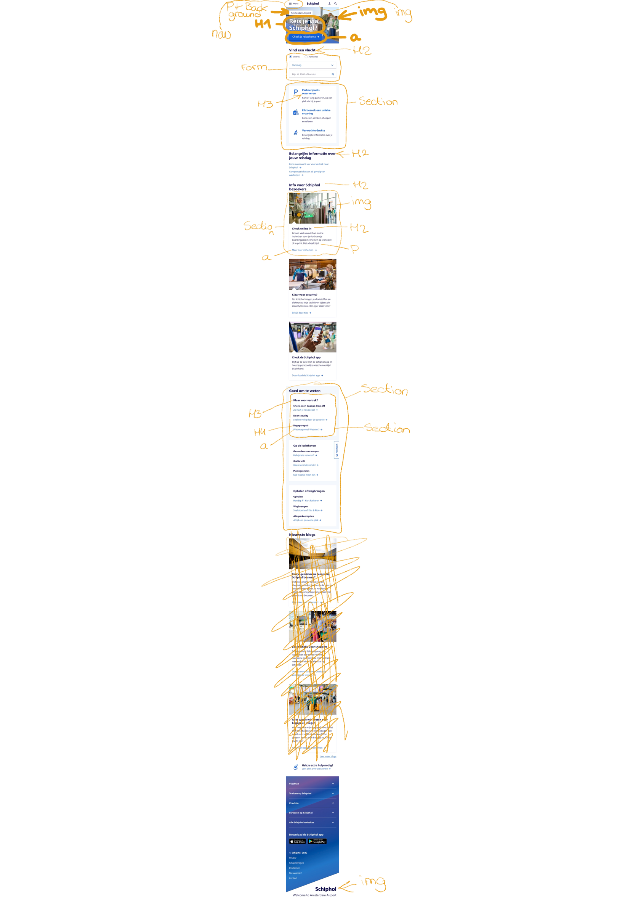

# Procesverslag
Markdown is een simpele manier om HTML te schrijven.  
Markdown cheat cheet: [Hulp bij het schrijven van Markdown](https://github.com/adam-p/markdown-here/wiki/Markdown-Cheatsheet).

Nb. De standaardstructuur en de spartaanse opmaak van de README.md zijn helemaal prima. Het gaat om de inhoud van je procesverslag. Besteedt de tijd voor pracht en praal aan je website.

Nb. Door *open* toe te voegen aan een *details* element kun je deze standaard open zetten. Fijn om dat steeds voor de relevante stuk(ken) te doen.

## Jij

  
uitwerken voor kick-off werkgroep

  ### Auteur:
  Vera van Vloten

  #### Je startniveau:
  Rood

  #### Je focus:
  Surface plane
 

## Je website

  
uitwerken voor kick-off werkgroep

  ### Je opdracht:
  https://www.schiphol.nl/nl/
  
  #### Screenshot(s) van de eerste pagina (small screen): 
  Schiphol homepage  
  

  #### Screenshot(s) van de tweede pagina (small screen):
  Schiphol covid page  
  
 

## Toegankelijkheidstest 1/2 (week 1)

  
uitwerken na test in 1e werkgroep

  ### Bevindingen
  Lijst met je bevindingen die in de test naar voren kwamen:
  - Genoeg tijd nemen voor het voldoen van taken.
  - Letters groter maken en zorgen voor duidelijk contrast. 

  #### Screenreader
  - Er wordt veel voorgelezen, geeft me stress. 
  - Soms wordt er teveel voorgelezen, denk dan aan hele menu's bovenaan de pagina. 
  - Missende info bij iconen of afbeeldingen. 

  Oplossingen: 
  - Keuze wat wel en niet wordt voorgelezen aan de hand van toetsen op het toetsenbord. 
  - Het keuzemenu niet bovenaan de pagina neerzetten of optie om het hele verhaal te skippen. 
  - Zorgen dat de alt teksten aanwezig zijn voor een goede screenreader ervaring.

  #### Muis en Toetsenbord 
  We hebben alleen gebruik gemaakt van de TAB-toets en de SHIFT-toets. De touchpad was verboden terrein. 
  Dit was best een uitdaging aangezien, je niet echt kan scrollen of zoiets, dit gaat allemaal aan de hand 
  van de TAB-toets.

  #### Motoriek (shocks, elastiekjes)
  Met de elastiekjes op mijn vinger drukte ik soms nog weleens op de verkeerde knopjes of twee tegelijk, 
  dan is gebruik maken van de TAB-toets erg handig, het voorkomt verwarringen.

  
  #### Visueel (brillen, contrast, kleurenblind, dark/light). 
  Sommige brilletjes waren gewoon heel erg irritant, omdat je dan maar weinig kon zien of een heel klein beetje of wazig, 
  het helpt dan om een hoog contrast te hebben. Of de lettergrootte te kunnen aanpassen.

## Breakdownschets (week 1)

  
uitwerken na afloop 2e werkgroep

  ### de hele pagina: 
  

  ### dynamisch deel (bijv menu): 
  

  ### wellicht nog een dynamisch deel (bijv filter): 
  
  Ik heb geprobeerd een breakdown schets te maken van de gehele pagina waarbij ook het dynamische deel wordt behandeld, zie foto.

## Voortgang 1 (week 2)

  
uitwerken voor 1e voortgang

  ### Stand van zaken
  Ik heb nog niet enorm veel gedaaan aan mijn website, ik heb moeite met opgang komen, waaardoor ik nog maar een deel heb van mijn html en nog geen styling.

  ### Agenda voor meeting
  samen met je groepje opstellen

  student 1: Er zijn voor mij niet echt dingen die ik gecheckt wil hebben, ben al lekker bezig.      
  student 2: Ik wil graag kijken naar of mijn html goed semantisch is en mijn CSS er al goed uitziet + tips daarbij.       
     

  ### Verslag van meeting
  hier na afloop snel de uitkomsten van de meeting vastleggen

  - Lekker aan de slag gaan.
  - Voor de navigatie: deels groeperen zodat iconen beter zijn uitgelijnd.
  - SVG en menu samen in een a
  - Icons samen

## Voortgang 2 (week 3)

  
uitwerken voor 2e voortgang

  ### Stand van zaken
  html eerste pagina compleet, begonnen aan CSS, loop vast met form en positionen van achtergrond afbeelding

  ### Agenda voor meeting
  samen met je groepje opstellen

  student 1: Er zijn voor mij niet echt dingen die ik gecheckt wil hebben, ben al lekker bezig.      
  student 2: Ik wil graag kijken naar of mijn html goed semantisch is en mijn CSS er al goed uitziet + tips daarbij. 
  

  ### Verslag van meeting
  hier na afloop snel de uitkomsten van de meeting vastleggen

  - punt 1
  - punt 2
  - nog een punt
- ...

## Toegankelijkheidstest 2/2 (week 4)

  
uitwerken na test in 8e werkgroep

  ### Bevindingen
  Lijst met je bevindingen die in de test naar voren kwamen (geef ook aan wat er verbeterd is):

  #### Screenreader
  Hier korte omschrijving (met indien nodig afbeeldingen)

  Hier een omschrijving van hoe het opgelost kan worden (met indien nodig afbeeldingen)

  #### Muis en Toetsenbord 
  Hier korte omschrijving (met indien nodig afbeeldingen)

  Hier een omschrijving van hoe het opgelost kan worden (met indien nodig afbeeldingen)

  #### Motoriek (shocks, elastiekjes)
  Hier korte omschrijving (met indien nodig afbeeldingen)

  Hier een omschrijving van hoe het opgelost kan worden (met indien nodig afbeeldingen)

  #### Visueel (brillen, contrast, kleurenblind, dark/light). 
  Hier korte omschrijving (met indien nodig afbeeldingen)

  Hier een omschrijving van hoe het opgelost kan worden (met indien nodig afbeeldingen)

## Voortgang 3 (week 4)

  
uitwerken voor 3e voortgang

  ### Stand van zaken
  hier dit ging goed & dit was lastig (neem ook screenshots op van delen van je website en code)

  ### Agenda voor meeting
  samen met je groepje opstellen

  | student 1      | student 2          | student 3    | student 4        |
  | ---            | ---                | ---          | ---              |
  | dit bespreken  | en dit             | en ik dit    | en dan ik dat    |
  | en dat ook nog | dit als er tijd is | nog een punt | dit wil ik zeker |
  | ...            | ...                | ...          | ...              |

  ### Verslag van meeting
  hier na afloop snel de uitkomsten van de meeting vastleggen

  - punt 1
  - punt 2
  - nog een punt
  - ...

## Eindgesprek (week 5)

  
uitwerken voor eindgesprek

  ### Je uitkomst - karakteristiek screenshots:
  

  ### Dit ging goed/Heb ik geleerd: 
  Korte omschrijving met plaatjes

  

  ### Dit was lastig/Is niet gelukt:
  Korte omschrijving met plaatjes

  

## Bronnenlijst

  
continu bijhouden terwijl je werkt

  Nb. Wees specifiek ('css-tricks' als bron is bijv. niet specifiek genoeg).

  1. bron 1
  2. bron 2
  3. ...

